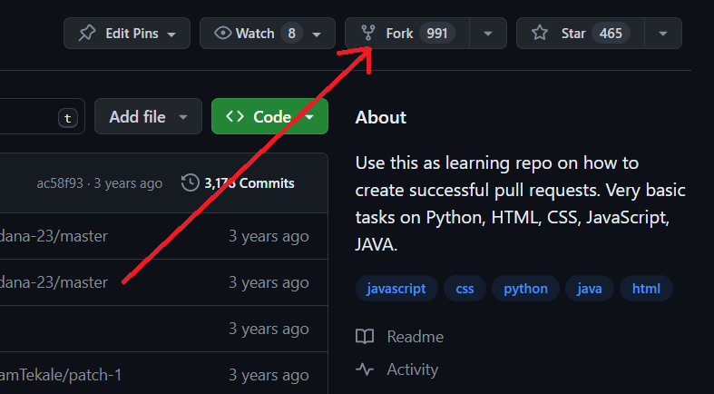
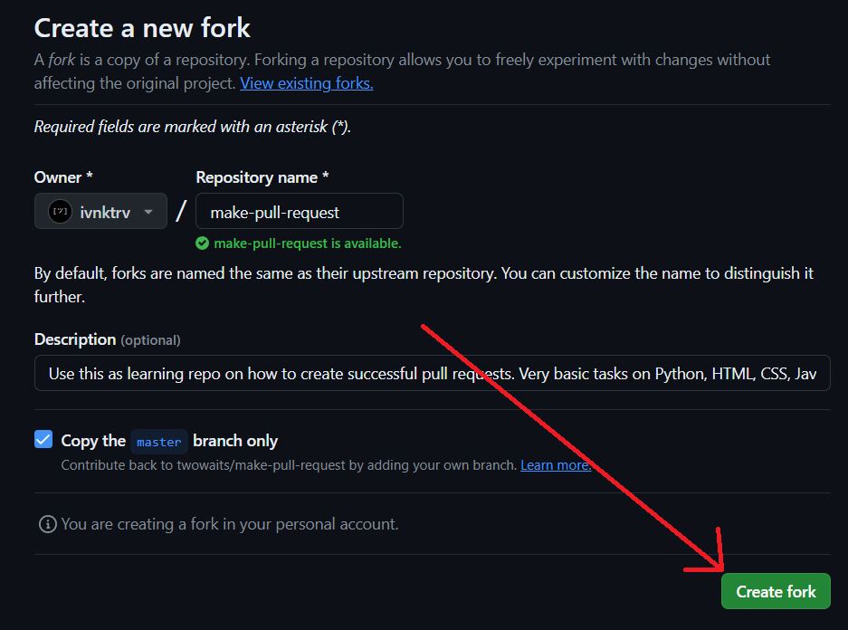
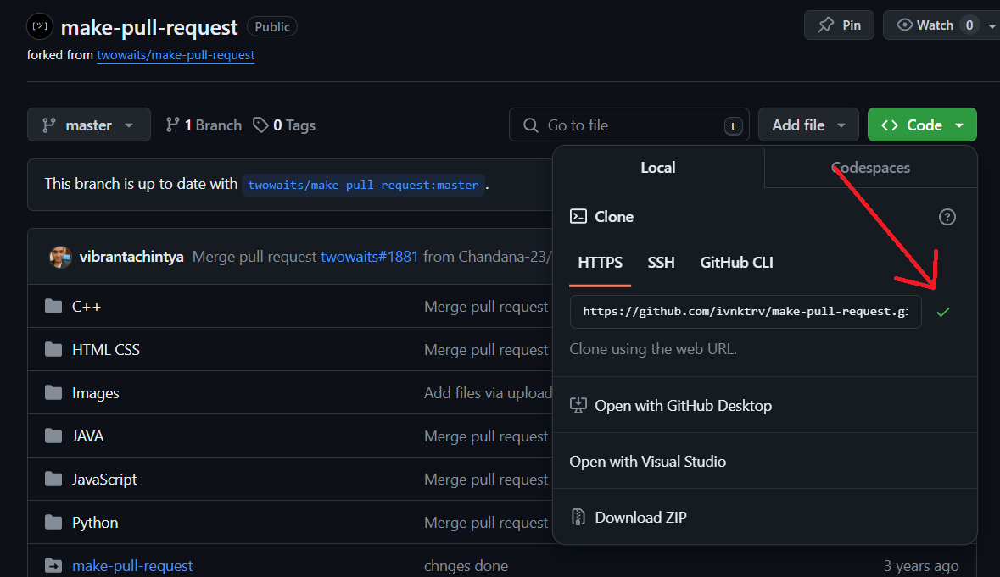
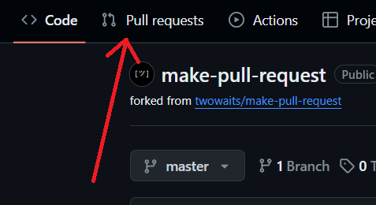
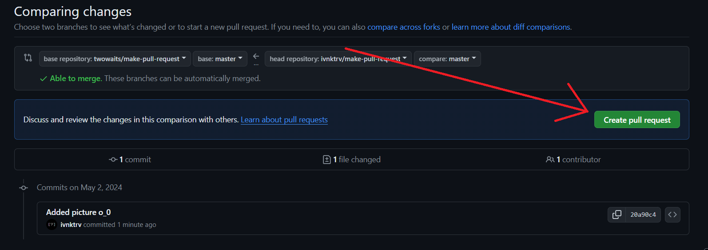
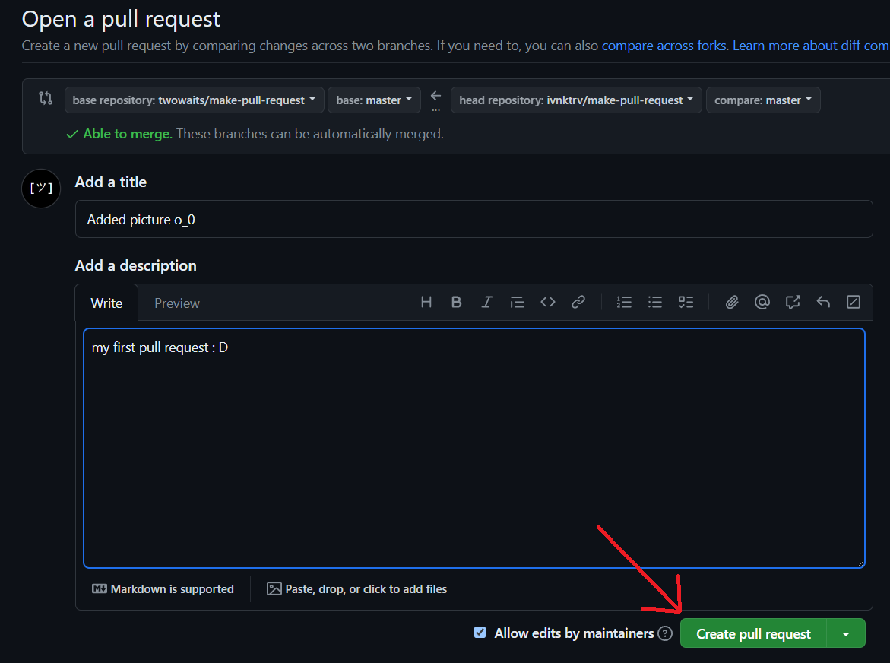
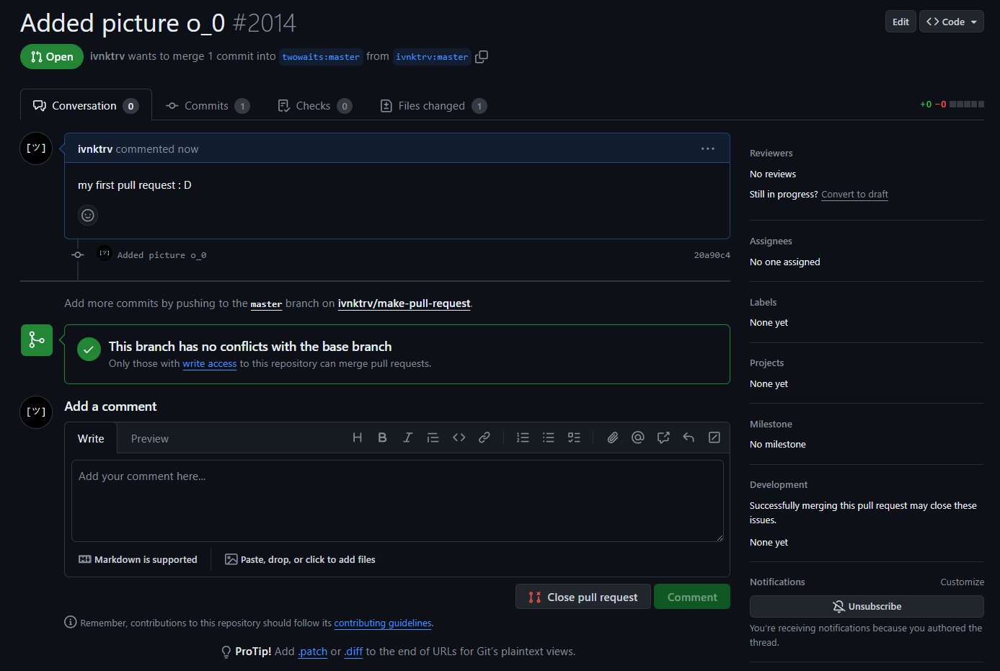

### `### КАК ВНЕСТИ СВОЙ ВКЛАД В ПРОЕКТ ###`

- Форкаете репозиторий
 

- Клонируете форкнутый репозиторий: `git clone <репозиторий>`

***
- Работаете с ним...
***
- Добавили новую фичу? - отправляете **pull request**

- В коментарии вкратце опишите что вы сделали.

- Готово `:D`. Ожидайте принятия ваших изменений

