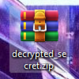

<center>
    
</center>

***

**XYZ Cryptor** - программа, которая шифрует файлы. То есть она делает копию оригинального файла, но эта копия - зашифрованный ориг файл.

Команды:

```
           ─┐
xyz -h      |_  Справка
xyz --help  |
           ─┘                                        ─┐
xyz -e [файл] [файл который будет зашифрован]         |_  Зашифровать файл
xyz --encrypt [файл] [файл который будет зашифрован]  |
                                                     ─┘
                                          ─┐           
xyz -d [зашифрованный файл] [ключ]         |_  Вывести расшифрованный текст на консоль
xyz --decrypt [зашифрованный файл] [ключ]  |
                                          ─┘
                                                                      ─┐           
xyz -d [зашифрованный файл] [ключ] --outfile [файл.расширение]         |_  Расшифровать и сохранить в файл
xyz --decrypt [зашифрованный файл] [ключ] --outfile [файл.расширение]  |
                                                                      ─┘
              ─┐
xyz -v         |_ Версия программы
xyz --version  |
              ─┘
```
***

**Например:**

- У нас есть [архив](example/SECRET.zip) с секретным содержимым:

<center>
    
</center>

- И мы хотим отправить этот архив другу. Чё делаем, открываем командную строку, переходим в папку где находиться прога и пишем: `xyz -e SECRET.zip program.exe`. Прога зашифрует файл и даст нам ключ от файла. В итоге мы получили вот это: 

<center>
    
</center>

- Это зашифрованный архив, которую мы "замаскировали" под exe-шник (можно хоть под картинку замаскировать). Отправили другу файл и ключ от него, и ещё не забыли сказать что это zip архив. И чтобы его расшифровать, наш друг пишет в командной строке: `xyz -d program.exe ключ --outfile decrypted_secret.zip`.

<center>
    
</center> 

- Готово : D

Для более лучшего шифрования можно делать многослойное шифрование, что это такое:

- Есть файл file.txt, шифруем: `xyz -e file.txt encrypted_file_1`. Получили ключ: `1`
- Теперь шифруем `encrypted_file_1`: `xyz -e encrypted_file_1 encrypted_file_2 `: Получили ключ - `2`
- И шифруем файл `encrypted_file_2`: `xyz -e  encrypted_file_2 encrypted_file_3`: Получили ключ - `3`

Теперь чтобы из файла `encrypted_file_3` получить `file.txt`, надо:

- Расшифровать `encrypted_file_3`, для него вставляем ключ `3`
- Потом `encrypted_file_2`, для него вставляем ключ `2`
- и на последнем месте `encrypted_file_1`, для него вставляем ключ `1`

***

### Хотите внести свой вклад в проект? - читайте [здесь](CONTRIBUTING.md)

***

Прикольно так у меня получилось что от **[этого файла](example/cl.xyz)** я случайно нашёл второй ключ (с первого раза угадал : /):
- 1 сгенерированный ключ: `2018022`
- 2 ключ: `487654`
